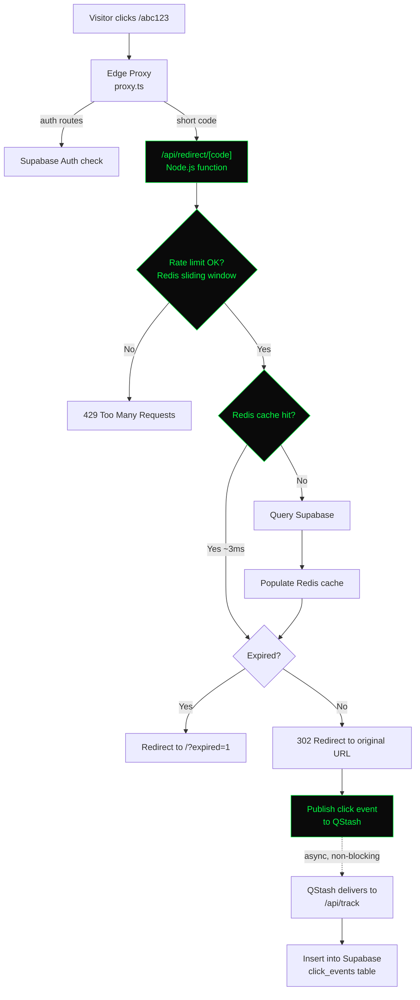

# cachelink

A URL shortener built to explore caching strategy, async event processing, and rate limiting under real production constraints — not just a CRUD app with a redirect.

**Live demo:** [shortify-url-shortener-seven.vercel.app](https://shortify-url-shortener-seven.vercel.app)

---

## What it does

Paste a long URL, get a short code back, share it. Every click is tracked — country, city, device, browser, referrer — and shown on a live stats page. Links can have an expiry date. Both redirects and link creation are rate limited.

The interesting part isn't the CRUD. It's *how* the redirect path is built to stay fast under load while still capturing analytics, without the analytics write ever blocking the person clicking the link.

---

## Architecture



The redirect returns to the visitor **before** the click event finishes writing to the database. Analytics happen in the background, on a separate request, after the redirect has already completed.

---

## Stack

| Layer | Technology | Role |
|---|---|---|
| Framework | Next.js 16 (Turbopack) | Edge proxy + serverless API routes |
| Database | Supabase (Postgres) | Users, links, click events |
| Cache | Upstash Redis | Sub-5ms link lookups, rate limit counters |
| Queue | Upstash QStash | Async, retried delivery of click events |
| Hosting | Vercel | Edge network + Node.js functions |
| Styling | Tailwind CSS | Terminal/matrix-themed UI |

---

## Why each piece exists

**Redis cache-aside pattern.** The first visit to a short code queries Postgres and populates a Redis key with a 24-hour TTL. Every subsequent visit within that window skips the database entirely. Cache invalidation happens explicitly when a link is deleted, so stale entries never serve a dead link.

**QStash for click tracking, not direct writes.** The redirect function could insert directly into `click_events` before responding. It doesn't, because that ties the speed of the redirect to the speed of the database. Instead it publishes a message to QStash and returns immediately — QStash delivers the event to `/api/track` on a separate request, with automatic retries if the delivery fails.

**Redis-backed rate limiting, not a new dependency.** Rather than adding a dedicated rate-limiting service, the limiter uses Redis sorted sets already in place for caching — each request adds a timestamp-scored entry, expired entries are trimmed, and the remaining count is compared against the limit. Redirects get a generous limit (60/min/IP) since they're expected to be frequent; link creation gets a strict limit (10/min/user) since it's a lower-volume, higher-abuse-risk action.

**Link creation moved server-side.** It originally ran as a direct insert from the browser to Supabase. That's not rate-limitable — a client can always re-issue the request without ever touching server code. Moving creation into `/api/links/create` means every write passes through the same process that enforces the limit.

---

## Problems hit during development (and the actual fixes)

**Vercel kept deploying an empty repo.** The build finished in 2 seconds and returned 404 on every route. Vercel's GitHub integration was connected to the wrong repository entirely — a placeholder, not the real codebase. Fixed by disconnecting and reconnecting the correct repo in Project Settings → Git.

**Outgoing fetch calls silently did nothing inside the Edge proxy.** Redis and QStash calls placed directly in `proxy.ts` never executed — no error, no log, just nothing. Next.js's Edge proxy runtime restricts outgoing requests. The fix was to keep the proxy thin (just an auth check and a rewrite) and move every external call into a real Node.js API route at `/api/redirect/[code]`.

**Fire-and-forget doesn't survive in serverless.** A `fetch(...).catch(() => {})` without `await` looked safe, but Vercel terminates the function the instant a response is sent — the in-flight QStash call gets cut off mid-request. The fix was to `await` the publish call before returning the redirect, which costs a few milliseconds but guarantees the event actually leaves the function.

**QStash was delivering to a preview URL with deployment protection enabled.** The callback URL was built from the request's dynamic origin, which on a preview deployment pointed at a Vercel-authenticated URL QStash couldn't reach — it kept hitting a login page instead of the API route. Fixed by hardcoding the production URL for QStash callbacks via an environment variable.

---

## Database schema

```sql
short_links (
  id          uuid primary key,
  user_id     uuid references auth.users,
  code        text unique,
  original_url text,
  title       text,
  created_at  timestamptz,
  expires_at  timestamptz nullable
)

click_events (
  id          uuid primary key,
  link_id     uuid references short_links,
  country     text,
  city        text,
  device      text,
  browser     text,
  referrer    text,
  clicked_at  timestamptz
)
```

---

## Running locally

```bash
git clone https://github.com/nag97/URL-SHORTENER.git
cd URL-SHORTENER
npm install
```

Create `.env.local`:

```
NEXT_PUBLIC_SUPABASE_URL=
NEXT_PUBLIC_SUPABASE_ANON_KEY=
SUPABASE_SERVICE_ROLE_KEY=
UPSTASH_REDIS_REST_URL=
UPSTASH_REDIS_REST_TOKEN=
QSTASH_URL=
QSTASH_TOKEN=
QSTASH_CURRENT_SIGNING_KEY=
QSTASH_NEXT_SIGNING_KEY=
NEXT_PUBLIC_APP_URL=
```

```bash
npm run dev
```

---

## What's not built (yet)

- Custom short domain (currently rides on the Vercel subdomain)
- Bulk link import/export
- Team/workspace support — links are per-user only
- Click event analytics beyond the four dimensions currently tracked
